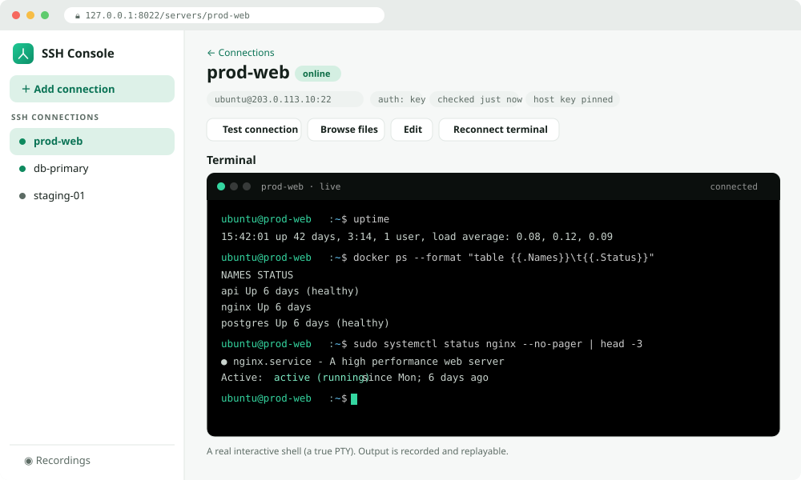
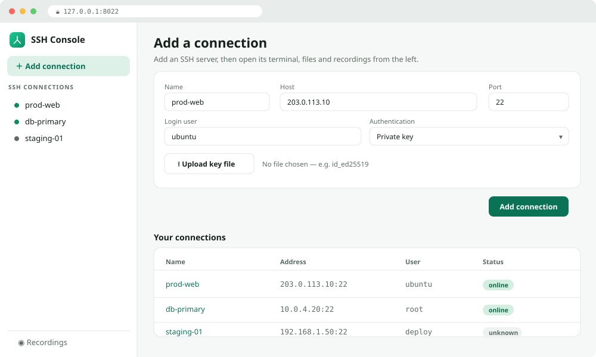
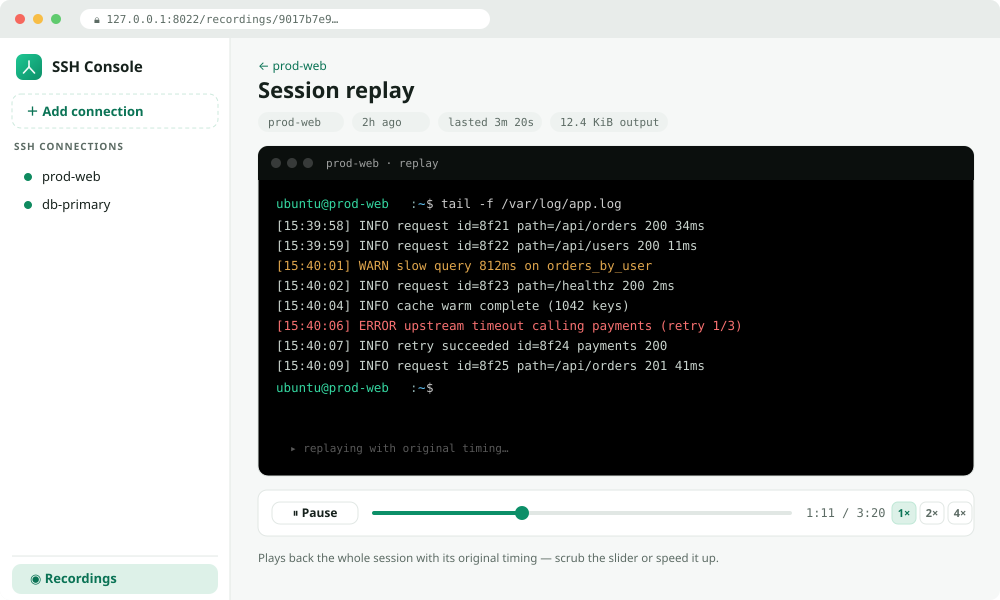

<div align="center">

# SSH Console

**A local, single-user web console for your SSH servers — with session recording.**

Open any server that runs `sshd` in a browser tab: a real terminal, an SFTP file
manager, and a one-shot command runner. Every terminal session is **recorded and
replayable** with its original timing.


</div>



---

## Overview

SSH Console runs on **your own machine** and gives you a browser UI over your SSH
servers. You add a server once (its credential is encrypted on disk), then from a
browser tab you get a real interactive terminal, a file manager, and a command
runner — and every terminal session is captured so you can replay exactly what was
run, and for how long.

It is deliberately small and focused: **no accounts, no login, no cloud.** It binds
to `127.0.0.1` by default and keeps everything in a single local SQLite file. There
is **no installer and no binary to manage** — you run it either as a Docker container
or as a Python module (`python -m ssh_console`).

**Why it exists:** a browser terminal you can reach from anywhere (via an SSH
tunnel), with a searchable, replayable history of what you actually did on each box —
without installing an agent on the servers themselves.

## Features

| | |
|---|---|
| 🖥️ **Web terminal** | A real PTY over SSH, in the browser (xterm.js). `top`, `vim`, `less` all work. |
| ⏺️ **Session recording** | Every session captured **with timing** and replayable — play / pause / seek / 1×·2×·4×. |
| 📁 **SFTP file manager** | Browse, upload (multi + drag-drop), download, in-place edit, mkdir, rename, delete. |
| ⚡ **Command runner** | Run a one-off command and see its output, with a palette of common commands. |
| 🔑 **Flexible auth** | Password or private key (upload the key file, or paste it). |
| 📌 **Host-key pinning** | Trust-on-first-use; if a server's key later changes, the connection is refused. |
| 🔒 **Encrypted at rest** | Credentials and recordings sealed with AES-256-GCM under a local master key. |
| 🗄️ **Zero external services** | One local SQLite file — no database to run, nothing installed on the target. |

## Screenshots

**Manage your connections** — add a server, then pick it from the sidebar:



**Replay a recorded session** — with its original timing, scrub and speed controls:



---

## How it works

SSH Console is a small web app in front of an SSH engine and a local encrypted store:

```
                 ┌──────────────── Web UI (FastAPI + Jinja2 + htmx + xterm.js) ────────────────┐
   browser ────▶ │  connections · terminal (WebSocket PTY) · files · command runner · replay   │
                 └───────────────┬──────────────────────────────────────────────────┬──────────┘
                                 │ calls                                             │ reads / writes
                         ┌───────▼──────── SSH engine (AsyncSSH) ──────┐   ┌─────────▼──────── Store ────────┐
   your SSH servers ◀────│  one dial-and-pin path · run · SFTP         │   │  SQLite: servers + recordings   │
                         └───────┬──────────────────────────────────────┘   └────────┬─────────────────────┘
                                 │ credentials come decrypted from                    │ secrets sealed with
                                 └──────────────── AES-256-GCM (local master key) ─────┘
```

- **One connect path.** The terminal, file manager and command runner all connect
  through a single function, so host-key pinning can never be bypassed by a feature.
- **Host keys are pinned on first use.** On the next connect the pinned key is
  verified during the handshake — a mismatch is refused **before any credential is
  sent** (a changed key means a possible machine-in-the-middle).
- **Secrets never touch disk in plaintext.** Passwords, private keys, passphrases and
  recordings are encrypted with a 32-byte master key generated on first run and kept
  in a `0600` file next to the database.
- **Nothing runs on the target.** It simply dials out over SSH; if a box runs `sshd`,
  it works.

---

## Quick start (Docker)

The fastest way — nothing to install but Docker.

```bash
docker compose up -d
```

Then open **<http://127.0.0.1:8022>**, add a server, and you have a terminal in the
browser.

- It publishes to `127.0.0.1` only — private to your machine, not the network.
- Your connections, recordings and master key live in a named volume (`data`) that
  survives restarts and upgrades.
- Stop it with `docker compose down` (the volume, and your data, remain).

`docker compose up -d` **builds the image and runs it** in one step — no separate
build needed. (Re-run it after pulling code changes; add `--build` to force a rebuild:
`docker compose up -d --build`.)

### Choosing the port

The container always listens on **8022 inside**. You pick the port you *browse to* by
changing the **left** side of the mapping — never the right side, and never put an IP
there.

- **Compose:** edit the `ports:` line in `docker-compose.yml`, e.g.
  `"127.0.0.1:9000:8022"`, then `docker compose up -d`. Browse `:9000`.
- **Plain Docker:** `-p 9000:8022`. Browse `:9000`.

<details>
<summary>Plain Docker, without Compose</summary>

With plain `docker`, you **must build the image first** — it isn't published anywhere,
so `docker run` on its own would try to download it and fail with *"pull access
denied"*.

```bash
docker build -t ssh-console .
docker run -d --name ssh-console -p 127.0.0.1:8022:8022 -v ssh-console-data:/data ssh-console
```

To use a different port, change the left number, e.g. `-p 9000:8022` → browse `:9000`.
</details>

## Run from source

Requires **Python 3.11+**. Create a virtual environment, install the dependencies,
and run the module.

**Windows (PowerShell)**

```powershell
python -m venv .venv
.\.venv\Scripts\Activate.ps1
pip install -r requirements.txt
python -m ssh_console
```

**macOS / Linux**

```bash
python3 -m venv .venv
source .venv/bin/activate
pip install -r requirements.txt
python -m ssh_console
```

Then open the URL it prints (default **<http://127.0.0.1:8022>**). Check the version
with `python -m ssh_console version`.

---

## Deploy on a remote server (VPS / EC2)

By default SSH Console binds to **`127.0.0.1` (localhost only)** and has **no login
screen**, so a browser on your laptop cannot reach it on a remote box directly. Pick
one of the two approaches below.

### Option A — SSH tunnel (recommended, keeps it private)

Run it normally on the server (loopback), then forward the port from your laptop:

```bash
ssh -L 8022:127.0.0.1:8022 ubuntu@YOUR_SERVER_IP
```

Leave that session open and browse to **<http://127.0.0.1:8022>** on your laptop. The
traffic tunnels to the server; **nothing is exposed to the internet** and no firewall
changes are needed.

### Option B — expose it on the server's public IP

Only if you understand the risk (see the warning). **Note:** plain `docker compose
up -d` binds to `127.0.0.1` (loopback only), so it is **not** reachable at
`your-server-ip:8022` — that's by design. To expose it, do one of:

**With Compose (easiest) — set `SSHCONSOLE_BIND`:**

```bash
SSHCONSOLE_BIND=0.0.0.0 docker compose up -d
```

(Change the host port too with `SSHCONSOLE_HOST_PORT=9000`; the container side stays
8022.)

**Or with plain Docker** — build first, then publish on all interfaces:

```bash
docker build -t ssh-console .
docker run -d --name ssh-console -p 8022:8022 -v ssh-console-data:/data ssh-console
```

Either way, confirm it's up (`docker ps` should show `0.0.0.0:8022->8022/tcp`), then
reach it from your laptop at **`http://YOUR_SERVER_PUBLIC_IP:8022`**.

> **Three mistakes to avoid** (each gives a confusing Docker error):
>
> 1. **Do NOT put the public IP in `-p`.** `-p 18.116.66.88:8022:8022` fails with
>    *"cannot assign requested address"* — on a cloud VM the public IP is **not** on
>    the machine's network interface (the OS only sees the private `172.31.x.x`); the
>    provider maps the public IP externally. Use `-p 8022:8022` (all interfaces) and
>    reach it *via* the public IP from outside.
> 2. **The right-hand port must stay `8022`** — that's the port *inside* the
>    container. To use a different host port, change only the left side, e.g.
>    `-p 9000:8022`. `-p 8023:8023` won't work (nothing listens on 8023 inside).
> 3. **Name already in use?** A failed `docker run` still creates the container, so
>    the name `ssh-console` gets taken. Remove it and re-run — your data is safe in
>    the volume:
>    ```bash
>    docker rm -f ssh-console
>    ```

Then **open the port in your firewall**, ideally only to your own IP:

- **Cloud provider firewall** (AWS Security Group, DigitalOcean, etc.): allow inbound
  **TCP 8022**, Source = *My IP*.
- **On the server, if `ufw` is active:**
  ```bash
  sudo ufw allow from YOUR_LAPTOP_IP to any port 8022 proto tcp
  ```

Now `http://YOUR_SERVER_PUBLIC_IP:8022` works. Confirm the app itself is healthy from
the server with `curl -s -o /dev/null -w "%{http_code}\n" http://127.0.0.1:8022/`
(`200` = healthy; then any remaining failure is firewall/network, not the app).

> ⚠️ **Security warning.** SSH Console has **no authentication** — anyone who can
> reach the port gets full control of every SSH server you've saved. If you expose it
> publicly, restrict the port to your own IP and put a reverse proxy with a login and
> TLS in front of it. If you're not doing that, use the **SSH tunnel** instead.

---

## Configuration

All optional — the defaults let you just run it. Set via environment variables.

| Variable | Default | Meaning |
|---|---|---|
| `SSHCONSOLE_LISTEN` | `127.0.0.1:8022` | Address to bind. Keep it on `127.0.0.1` unless you've read the deploy warning. |
| `SSHCONSOLE_DATA_DIR` | per-OS (below) | Where the SQLite database and master key live. |
| `SSHCONSOLE_MAX_TERMINALS` | `0` (unlimited) | Optional cap on concurrent live terminals. There is **no limit** on saved connections. |

### The data directory

If `SSHCONSOLE_DATA_DIR` is unset, SSH Console uses your OS's per-user config
location:

| OS | Default data directory |
|---|---|
| Windows | `%AppData%\ssh-console` |
| macOS | `~/Library/Application Support/ssh-console` |
| Linux | `~/.config/ssh-console` (or `$XDG_CONFIG_HOME/ssh-console`) |
| Docker | `/data` (mount a volume there) |

It contains `ssh-console.db` (your connections and recordings, secrets encrypted) and
`master.key` (the AES-256 key that decrypts them).

> **Back up this directory.** If you lose `master.key`, the stored credentials and
> recordings can no longer be decrypted. Never commit either file — the included
> `.gitignore` blocks them.

---

## Security notes

- **Localhost only by default.** No login screen because there is nothing between you
  and the tool on your own machine. Expose it only behind real auth + TLS.
- **Encrypted at rest.** Passwords, private keys, passphrases and recordings are
  sealed with AES-256-GCM before being written to the database.
- **Host-key pinning (TOFU).** The server's key is pinned on first connect and
  verified on every later one, during the handshake, before any credential is sent.
- **Recordings can contain secrets.** A recording captures whatever scrolled past —
  treat recordings as sensitive and delete ones you don't need.
- **Outbound abuse guard.** Connections to link-local and cloud-metadata addresses
  (e.g. `169.254.169.254`) are refused; private LAN ranges are allowed.
- **Keys:** OpenSSH / PEM private keys are supported (PuTTY `.ppk` is not).

---

## Project structure

```
ssh_console/
├── __main__.py          entrypoint — starts the server (python -m ssh_console)
├── config.py            environment, data directory, master-key handling
├── crypto.py            AES-256-GCM envelope encryption
├── store.py             SQLite persistence: connections + recordings
├── remote/              the SSH engine (AsyncSSH)
│   ├── manager.py         one dial-and-pin path · run · SFTP
│   └── dialguard.py       refuses link-local / cloud-metadata targets
└── web/                 the HTTP layer (FastAPI + Jinja2)
    ├── app.py             routes, the WebSocket terminal, the delete guard
    ├── palette.py         the command palette
    ├── recorder.py        captures terminal output as timed events
    ├── templates/         server-rendered pages
    └── static/            CSS, favicon, xterm.js + htmx
```

## Tech stack

FastAPI + Uvicorn · AsyncSSH · `cryptography` (AES-256-GCM) · SQLite (standard
library) · Jinja2 · xterm.js + htmx on the front end.

## License

[MIT](LICENSE) © Abdul Rauf.
